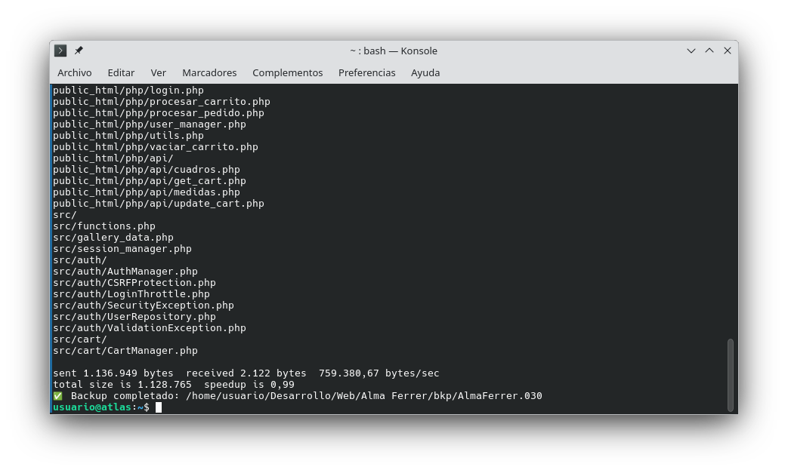

# secure_cp

**secure_cp** is a lightweight Bash script for creating structured backups of virtual servers or development environments.  
It automatically generates sequential backup directories (e.g. `DocumentRoot.001`, `DocumentRoot.002`, …), excludes specified directories, and preserves previous backups to maintain a clear version history.

---

## Features

- Creates automatically numbered backup directories.
- Prevents overwriting existing backups.
- Skips redundant or heavy data (such as images or videos) according to your exclusion rules.
- Allows full customization of excluded directories and files.
- Simple and fast – ideal for local or remote server backup routines.

---

## Usage

1. **Download the script**

   Save the `secure_cp` file to your preferred location and make it executable:

   ```bash
   chmod +x secure_cp
   ```

2. **Edit configuration paths**

   Open the script with your preferred text editor and modify the following lines to match your environment:

   ```bash
   ORIGEN="/var/www/DocumentRoot"
   DESTINO_BASE="/home/usuario/Desarrollo/Web/Example/bkp"
   NOMBRE_BASE="DocumentRoot"
   ```

   - `ORIGEN` → path to your source directory (e.g., your web root).  
   - `DESTINO_BASE` → directory where backups will be stored.  
   - `NOMBRE_BASE` → base name used for the backup directories.

3. **Edit excluded directories (optional)**

   You can define which folders or files should be ignored during the backup process by modifying the `--exclude` parameters inside the script.  
   For example:

   ```bash
   --exclude='public_html/img' \
   --exclude='vendor' \
   --exclude='public_html/videos'
   ```

   Add or remove exclusions as needed to avoid copying redundant, heavy, or dynamically generated data.

4. **Run the script**

   Execute the script from your terminal:

   ```bash
   ./secure_cp
   ```

   The script will create a new backup directory such as:

   ```
   /home/usuario/Desarrollo/Web/Example/bkp/DocumentRoot.001
   ```

   Each new execution will increment the backup index automatically (`DocumentRoot.002`, `DocumentRoot.003`, …).

---

## Example

If your document root is `/var/www/html` and you want to store backups in `/mnt/backups/html`, you would set:

```bash
ORIGEN="/var/www/html"
DESTINO_BASE="/mnt/backups/html"
NOMBRE_BASE="html"
```

Then simply run:

```bash
./secure_cp
```



---

## License

This project is licensed under the **GNU General Public License v3.0 (GPLv3)**.  
You are free to use, modify, and redistribute this software under the terms of the GPLv3.  
See the [LICENSE](LICENSE) file for more details.
